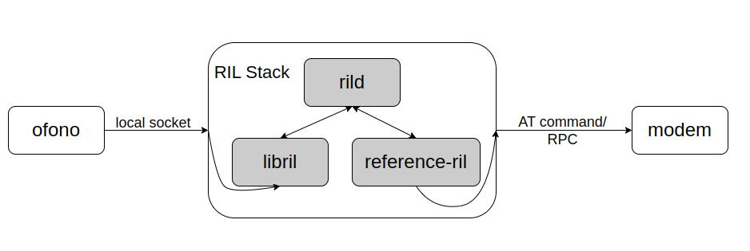

# Ril Documentation

[English|[简体中文](./README_zh-cn.md)]

## **Overview**

RIL (Radio Interface Layer) is a component used in the VELA platform. RIL consists of RILD, LIBRIL and REFERENCE-RIL to form a complete wireless communication architecture. It is an intermediate layer between the VELA system and the baseband. Through the RIL layer, the operating system can interact with the wireless communication hardware.



## **Project Directory**
```tree
├── include
│   └── telephony
│       ├── ril.h
│       └── ril_log.h
├── libril
│   ├── parcel.cpp
│   ├── parcel.h
│   ├── ril_commands.h
│   ├── ril.cpp
│   ├── ril_cus_commands.h
│   ├── ril_event.cpp
│   ├── ril_event.h
│   ├── ril_ims_commands.h
│   ├── ril_second_commands.h
│   └── ril_unsol_commands.h
├── reference-ril
│   ├── at_call.c
│   ├── at_call.h
│   ├── atchannel.c
│   ├── atchannel.h
│   ├── at_data.c
│   ├── at_data.h
│   ├── at_modem.c
│   ├── at_modem.h
│   ├── at_network.c
│   ├── at_network.h
│   ├── at_ril.c
│   ├── at_ril.h
│   ├── at_sim.c
│   ├── at_sim.h
│   ├── at_sms.c
│   ├── at_sms.h
│   ├── at_tok.c
│   └── at_tok.h
├── rild
│   └── rild.c
├── README.md
└── README_zh-cn.md
```

## **Module Introduction**

| Module     | File  | explain      |
| :------ | :------- | :--------- |
| Rild | rild.c  | <div style="width: 250pt">Initialize the RIL layer |
| LibRil | libril/* | AT command conversion and data analysis |
| Reference-ril | reference-ril/* | Send and receive commands to the Modem |


### **Function Introduction**

#### Rild
- Initialize the RIL layer: initialize LibRil and start Reference RIL.
- Receive upper-layer requests: Send the communication request of application to LibRil for processing.

#### LibRil
- Request conversion and command sending: Responsible for converting the requests into AT commands and send to the Reference-ril.
- Request reception and command response: The data responded by Reference-ril will be parsed by LibRil to ensure that the upper-layer application can handle these responses correctly.

#### Reference-ril
- Active request command: send AT command to Modem.
- Receive commands: Receive commands from LibRil or Modem.
